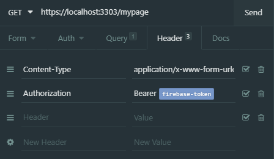

Sign in firebase using OAuth2 access token and return firebase ID token or OAuth access token

If token have refresh token, Auto refresh access token and Id token.

## install
location : Application -> Prefereces -> Plugins -> Show Plugins Folder

## how to

### 1. configure OAuth 2 (just use to store OAuth2 info, don't have to make url)

configure OAuth2

GRANT CODE : Authorization Code

AUTHORIZATION URL : [auth_url]

ACCESS TOKEN URL : [access_tokne_url]

CLIENT ID : [client_id]

CLIENT SECRET : [client_secret]

REDIRECT URL : [redirect_url]

SCOPE : https://www.googleapis.com/auth/userinfo.email https://www.googleapis.com/auth/userinfo.profile

### 2. Send
push send button REST API configured OAuth2 (don't need url)

### 3. Add header in other rest API 
at that time, signin firebase using OAuth2 google access token

don't configure OAuth2 tab (config no authentication)

Key(Header Name) : Authorization

Value : (Bearer ) Ctrl+Space해서 click the firebase-Token and write firebase_API_Key, providerId and token

## 제안사항
only possible google account.

need firebase account and link to google authentication(Web Client).

If token don't have refresh token, expired access token and ID token in 1 hour.